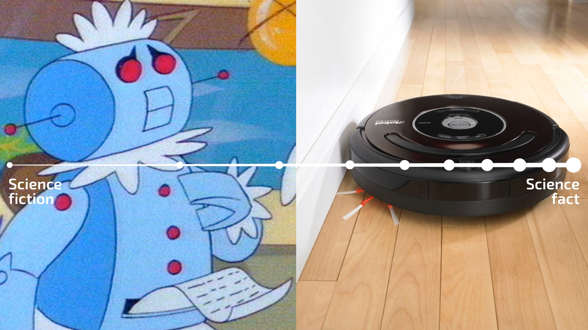
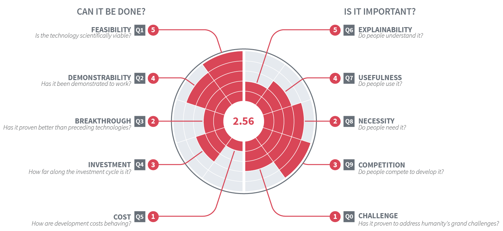
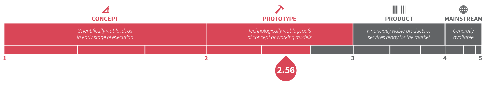

# How it works?

Ten vectors are measured. Technologies are  scored on growth along each vector. Point Scores are attributed on a human-readable scale

1. **Feasibility**: Is the technology scientifically viable?
2. **Demonstrability**: Has it been demonstrated to work?
3. **Breakthrough**: Is it measurably better than preceding technologies?
4. **Investment**: How far along the investment cycle is it?
5. **Cost**: How are development costs behaving?
6. **Explainability**: Do people understand it?
7. **Usefulness**: Do people use it?
8. **Necessity**: Do people need it?
9. **Competition**: Do people compete to develop it?
10. **Challenge**: Has it proven to address humanity's grand challenges?

## Mathematical Model

Point Scores are combined into a Final Score. Final Score is calculated as the harmonic mean of Point Scores. Harmonic mean is the preferable method for averaging ranges. Final Score indicates overall readiness in thresholds. 

