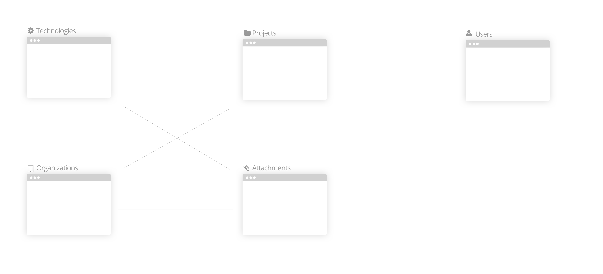

/*
Title: Getting started
Description: Getting Started with TDB
*/

As this is a closed beta with a restrict number of participants, we expect to have a high level of discussion about TDB. We are specially interested in feedbacks & ideas about:

* User Experience & User Interface
* General flow of modules and system
* Business Model Ideas
* New features and Modules

If you would like to get your hands a bit dirtier, we are constantly looking for **Developers** and **Designers** that would like to help.

## Accessing & Credentials

If you have subscribed for the closed beta, you've received an e-mail with an URL to complete your signup process. Check your Spam box or search for `hello@envisioning.io`. If you still haven't gotten it or haven't subscribed to the beta, [get in touch](mailto:as@envisioning.io).

Access TDB at [https://tdb.envisioning.io](https://tdb.envisioning.io).

## Basic Concepts

TDB has 5 main object types that can be related to on another.

1. Technologies
2. Projects
3. Organizations
4. Attachments
5. Users

Each of them will be explained thoroughly in the next session.