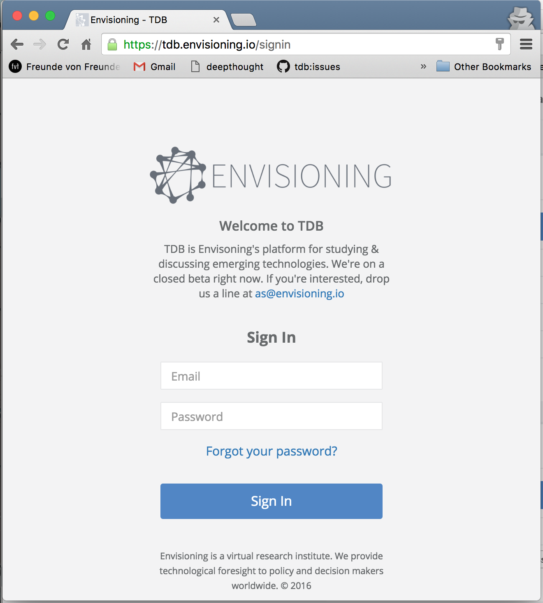

# Getting Started

## Why are we building this?

The project started as a way to streamline our research process. An unpleasing amount of work was done every time we started a new research. That is because we didn't have an appropriate tool to manage database that fit our workflow. We've been through it all: Trello, Basecamp, Spreadsheets, you name it…

## Current state

At the moment of this release (v0.8-Closed Beta), TDB primarily serves as a tool for Envisioning' projects. It is being developed with our research workflow and needs in mind.

* Easy collection / reorganization and manipulation of data
* Easy export for Godzilla

[Internal tool for research project]
[External Collaborators]
[External Viewers]
[JSON Export for Godzilla]

## Access

If you have subscribed for the closed beta, you've received an e-mail with an URL to complete your signup process. Check your Spam box or search for `hello@envisioning.io`. If you still haven't gotten it or haven't subscribed to the beta, [get in touch](mailto:as@envisioning.io).

**Accessing TDB**

Head over to: [https://tdb.envisioning.io](https://tdb.envisioning.io). That is our production instance of TDB. 