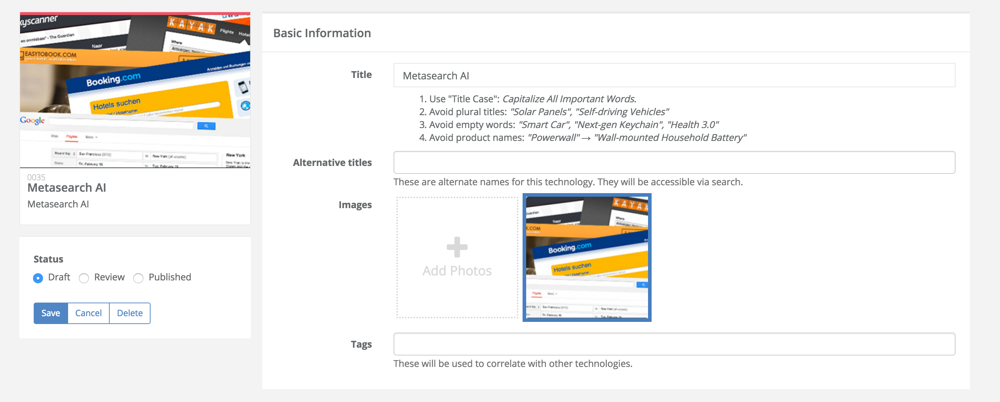
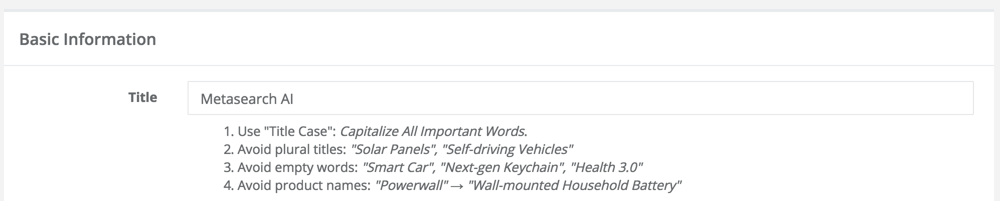

# Creating and Editing

We follow some rules and style guide for creating and editing technologies.

**Isolating technologies from Products/Startups **

* Look for possible  keywords connected to the technology/ technologies in the description
  * SpaceX -> Reusable Rocket, Autonomous Spaceport Drone Ship
*  Use the Keywords to find main companies, startups or researchers working with the technology and look for native content (.edu, .org are the best) 
* Find commentary about the techs in journalistic articles (to grasp a sense of what the public outlook on the tech is)

---

## Title

<table>
    <tr>
        <th>Title</th>
        <th>Example</th>
    </tr>
    <tr>
        <td>
            <ol>
                <li>Summarize technology in one to five words </li>
                <li>Good titles explain what sets the technology apart</li>
                <li>Use "Title Case".</li>
                <li>Capitalize All Important Words</li>
                <li> Avoid plural titles. </li>
                <ol>
                    <li> “Solar Panels", “Self-driving Vehicles" </li>
                </ol>
                <li> Avoid empty words.</li>
                <ol>
                    <li>“Smart Car", "Next-gen Keychain", "Health 3.0"</li>
                </ol>
                <li>Avoid product names.</li>
                <ol>
                    <li>“Powerwall" → "Wall-mounted Household Battery" </li>
                </ol>
                <li>Titles can be either: </li>
                <ol>
                    <li>Scientific ("802.11ad")</li>
                    <li>Technical ("Wi-Fi") </li>
                    <li>Popular ("Wireless Networking")</li>
                </ol>
            </ol>
        </td>
        <td>
            <ol>
                <li>Virtual Reality Headset</li>
                <li>Personal Transportation Device</li>
                <li>Aerial Wireless Network</li>
                <li>Gesture Control Wearables</li>
        </td>
    </tr>
</table>

---

## Alternative Title

These are not visible on the technology cards, but are used as search terms. This field is useful when we have a technology with different synonyms. We want to enforce using a correct nomenclature on the `Title` and additional names here.

**Example**

| Title | Alternative Titles|
|----|---|
| Delivery Drone | Payload Drone, Autonomous Delivery System |

---

## Images

1. Use images that are descriptive & noteworthy
1. Use HD images 
  1. Minimal resolution is 800x600px
2. Show action or engagement where possible
3. Photographs > Illustrations
4. Concept renderings are OK
